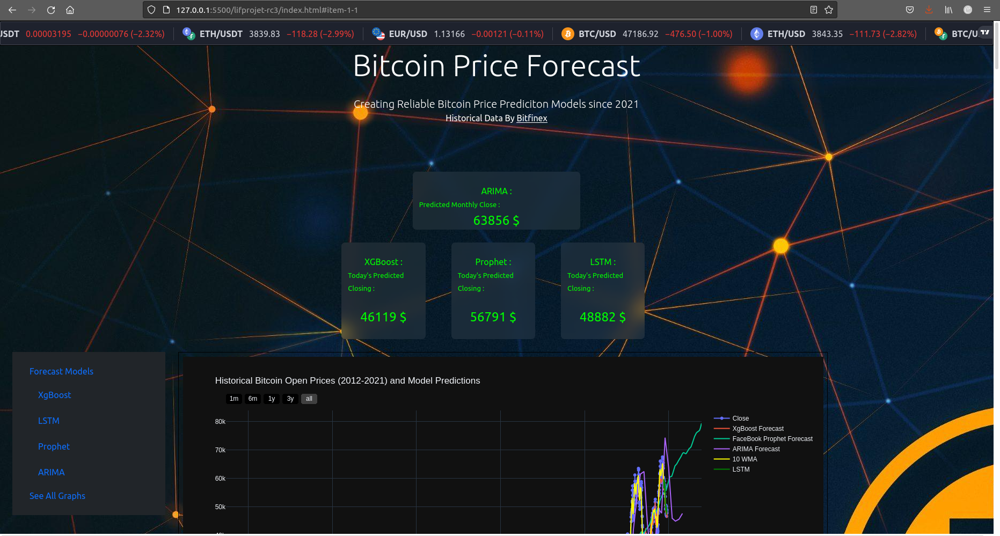

# [Bitcoin](https://coinmarketcap.com/currencies/bitcoin/) Price Forecast
### LIFPROJET RC3

 #### _Projet dans le cadre de L'UE [LIFPROJET](http://cazabetremy.fr/wiki/doku.php?id=projet:presentation) basée sur le sujet RC3 : Kaggle Challenges_

***
### **Objectif :**
### Une application Python qui applique plusieurs modèles prédicitives sur les données historiques OHLCV (2012-2021) du [Bitcoin](https://coinmarketcap.com/currencies/bitcoin/) et prédit le prix de ce dernier , les résultats sont présentés sur le site web dans `index.html` .
### Les modèles prédictives implémentés :
 * XGBOOST  : eXtreme Gradient Boosting .
 * Facebook Prophet .
 * LSTM : Long short-term Memory.
 * ARIMA : Auto Regressive Intergated Moving Average .
---
### **Installation :** 
#### _On recommende l'utilisation de l'application dans un environnement anaconda fonctionnel._
* ### **Linux :**
  * #### On peut faire   `git clone` directement du page [GitLab](https://forge.univ-lyon1.fr/p1803192/lifprojet-rc3) du projet .
  * #### Pour l'application on se mets dans le répertoire `~lifprojet-RC3` et lancer la commande : 
    `python3 projet_test.py`  
  * ####  Pour  mieux visualiser les données lancer la page web `index.html` dans votre navigateur web .
    #
    #### **Dépendances :**
  * ##### Numpy.
  * ##### Matplotlib.
  * ##### Pandas .
  * ##### plotly.
  * ##### Sklearn.
  * ##### Keras.
  * ##### Xgboost.
  * ##### Seaborn .
  * ##### Scipy.
  * ##### Statsmodels .
  * ##### Fbprophet .
---
### Contenu Du répertoire Git :
* `./output` : les fichiers des résultats géneré par `projet_test.py` .
* `./ouput/txt` : Les prédictions de chaque modèle  sur le dernier prix de Bitcoin aujourd'hui  et les MAE et RMSE de ces modèles.
* `./output/html` :  Contient les graphes des prédictions génerés par `projet_test.py` en format HTML.
* `./output/png` :  Contient quelques graphes des prédictions génerés par `projet_test.py` en format PNG.
* `index.html` : Fichier html de la page web pour visualiser les résultats.
* `projet_test.py` : Un fichier python qui contient l'implémentation de tous les modèles et génere des graphes et des résultats qu'on présente dans `index.html` .
----------------------------------------------------------------
### Résultat :
